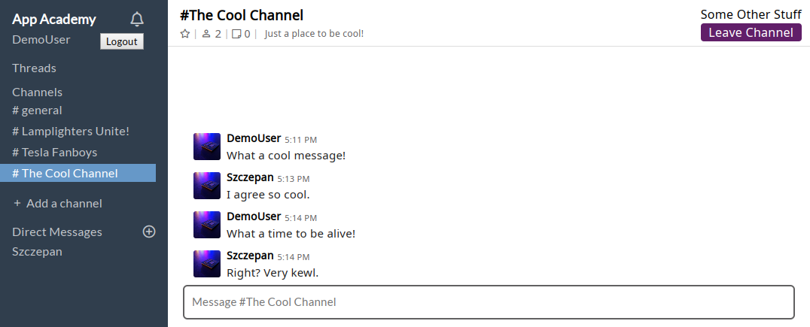
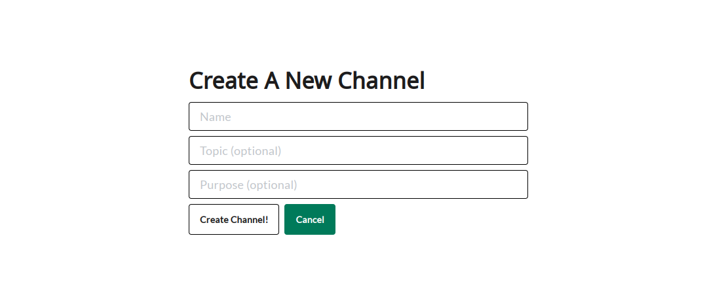
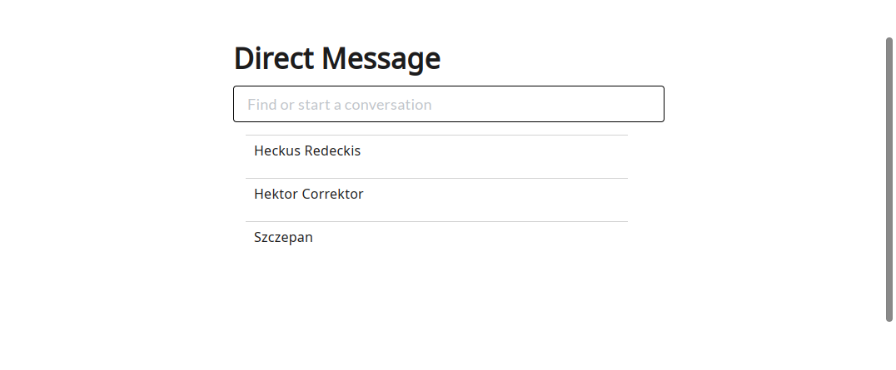

# Ye Olde Slaec 

Live Project: [Ye Olde Slaec](https://slaec.herokuapp.com/#/ "Live Slack clone")

Ye Olde Slaec is a clone of Slack, a feature rich communication platform for
team projects and businesses.  Slaec offers channel and direct messaging, the 
ability to create your own channels, set a channel topic, unsubscribe from a 
channel or delete your messages.  Users can even add reactions to messages or
start a message thread.

### Featured Technologies
  1. Javascript
  2. Ruby
  3. PostgresSQL
  4. HTML
  5. SCSS/CSS

### Libraries and Featured Frameworks
  - React
  - Redux
  - Ruby on Rails
  - jQuery for Ajax calls to the API
  - User Auth through BCrypt


The splash page gives you the option to sign in or sign up, putting your email
directly into the main hero pushes you to the sign up page automatically.  The
floating icon animation is achieved using a simple utility that slowly
increments a variable being repeatedly fed into sin/cos functions, the output of which
is used to translate the relative position of each icon in CSS.



The workspace features a navigation bar that lets users select the active channel
or a direct message.  Messages for that channel are displayed in the main window
and any relevant channel information is displayed above in a channel header.
Here users can set the channel topic or leave the channel.  Below in the messages
form users can posts messages to the channel.

<!--  -->
<!--  -->



Users can create a new channel, setting the topic and purpose if they'd like.
The topic can be changed later at anyone's discretion.
Once a channel is created, users must subscribe to the channel by navigating 
to it and subscribing manually.



Users can also send messages directly to anyone or group of people.  Direct 
messages are private and only viewable by the sender and receiver(s) of it.

## Code Snippets
The front splash animation was of interest to a few peers, so here's the utility function responsible for it.
```js

const splashIconAnim = (iconId, dir) => {
  let icon = document.getElementById(iconId);
  let angle = 0;
  let inc = dir * 0.05;
  let id = setInterval(frame, 50);
  let x, y;
  let phase = Math.random() * 2 * Math.PI;
  function frame() {
    x = 20 * Math.cos(angle + phase);
    y = 20 * Math.sin(angle + phase);
    icon.style.transform = `translate(${x}px, ${y}px)`;
    angle += inc;
  }
}

export default splashIconAnim;
```
It's relatively compact and each call just grabs the relevant asset as placed in the html portion of the code and applies an interval function to it.  The variable `dir` is just a positive or negative 1 and is rotation direction (clockwise/anti-clockwise), with `iconId` just being the id given to the html element.  `frame()` adds a translation element to the CSS portion and is responsible for the update to location itself, `phase` is a random starting value for each icon such that they don't all start at the same location and rotate in unison.

### Site Features
  * Signup / Login with email and password
  * Channel browsing, creation, and messaging
  * Direct Messages
  * Message Reactions
  * Message Threads
